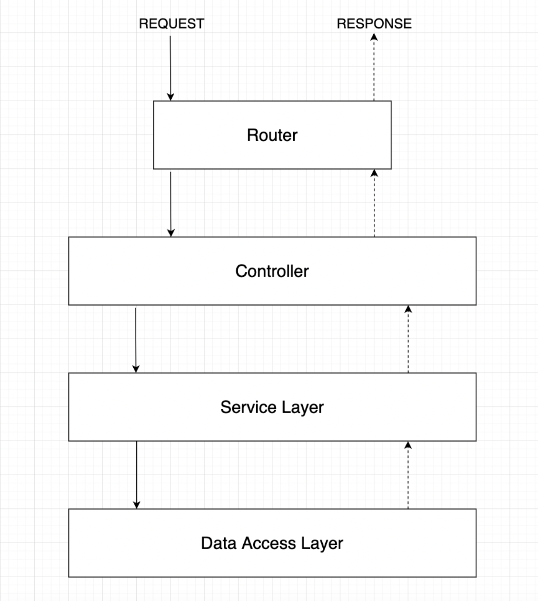

# PPAI Backend

### **Explicacion basica de la distribucion y la arquitectura del proyecto**:

La arquitectura del proyecto esta separada en 4 capas:

- El **Router**(carpeta router): contiene todos los archivos de rutas divididos por interfaz. Son archivos con el formato [interfaz_nombre].router.js; que contienen todas las rutas posibles para esa interfaz.
- El **Controller**(carpeta controller): tiene todas las definciones de las clases controller que se derivan directamente del modelo de clases. Implementa todos los metodos que dan soporte a las rutas de alguna de las interfaces.
- El **Service Layer**(carpeta services): tiene todas las clases entity que se derivan del modelo de clase. Tienen todos los metodos que llevan a cabo la logica de negocio y la interaccion con la capa de datos.
- La Data Access Layer(carpeta database): contiene las clases que se ocupan de la interaccion con la BD local. Ademas podemos definir los modelos de datos de sequalize aca.

### Ayuda y documentacion sobre Clases y POO en JavaScript

- Esto esta piola: [MDN Web Docs - Clases en JS](https://developer.mozilla.org/en-US/docs/Web/JavaScript/Reference/Classes)
